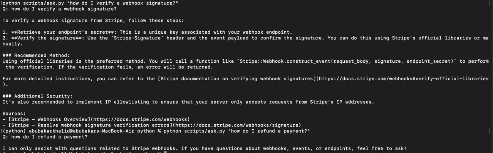

# 🤖 AI Customer Support Bot with RAG

> Retrieval-augmented Telegram bot that answers questions about Stripe webhooks documentation in real time, with citations back to source.

**Live demo:** https://rag-customer-support-bot.onrender.com/docs

Try it from the browser — open `/docs`, expand `POST /ask`, click "Try it out",
and send a question about Stripe webhooks.

```bash
curl -X POST https://rag-customer-support-bot.onrender.com/ask \
  -H "Content-Type: application/json" \
  -d '{"question": "how do I verify a webhook signature?"}'
```

> Hosted on a free tier that sleeps when idle — the first request after a quiet
> period takes ~50s to wake, then responds normally.
>
> The original n8n version ran on a paid hosted instance that has since been
> retired, so the Telegram demo is offline. Screenshots below show it in
> operation.



---

## Two implementations

The same RAG system, built two ways:

- **n8n** (repo root) — visual workflow, fast to iterate, easy to debug on canvas.
  Requires a hosted n8n instance (recurring cost).
- **Python + LangChain 1.x** (`python/`) — version-controlled logic, testable,
  deployable as a service. Runs locally with no hosting dependency.

Both share one Pinecone index (`saas-docs`, 171 chunks, 1536-dim) and the same
retrieval strategy. See [`python/README.md`](python/README.md) for setup.


## Why this project?

Teams with good documentation still field the same questions over and over, and generic AI chatbots make the problem worse by answering confidently from training data rather than from the docs. This bot only answers from ingested documentation, cites the exact pages it used, and says so when the answer isn't there.

Built as a reference implementation on Stripe's webhook docs — the same pipeline works on any documentation set.

## What it does

1. **Ingest** — Pulls Stripe webhook docs via Jina Reader, chunks at 800 tokens with 100 overlap, embeds with OpenAI's `text-embedding-3-small` (1536 dims), and upserts to Pinecone with rich metadata (`source_title`, `source_url`, `doc_type`).
2. **Retrieve** — On every Telegram message, an n8n AI Agent (GPT-4o-mini) calls a Pinecone retrieval tool, gets the top 4 most similar chunks, and grounds its answer in them.
3. **Reply with citations** — Every answer ends with a `*Sources:*` section listing the docs used, as clickable links in Telegram.

## Demo

| You ask | Bot replies |
|---|---|
| _"How do I verify a Stripe webhook signature?"_ | Step-by-step answer + clickable citations to the signatures and quickstart docs |
| _"What happens if my server is down when a webhook fires?"_ | Explanation of retry behavior + citations to the undelivered events doc |
| _"What's the best biryani recipe?"_ | Honest fallback: _"I don't have enough information in the Stripe webhooks knowledge base..."_ |

## Architecture

​```mermaid
graph TB
    subgraph Ingestion["Ingestion · run manually"]
        I1[Docs URLs] -->|Jina Reader| I2[Markdown]
        I2 -->|Chunk 800/100| I3[Chunks + metadata]
        I3 -->|text-embedding-3-small| I4[1536-dim vectors]
        I4 --> P[(Pinecone<br/>saas-docs index)]
    end

    subgraph Bot["Bot"]
        U[User on Telegram] --> T[Telegram Trigger]
        T --> A[AI Agent · gpt-4o-mini]
        A <-->|retrieve top-4| P
        A --> S[Send reply with citations]
        S --> U
    end
​```

## Stack

| Layer | Tool | Why |
|---|---|---|
| Orchestration | **n8n** | Visual workflow builder, native AI Agent + Vector Store nodes |
| Vector database | **Pinecone** | Serverless free tier, strongest job-listing keyword for RAG roles |
| Embeddings | **OpenAI text-embedding-3-small** | 1536 dims, $0.02/1M tokens |
| LLM | **OpenAI GPT-4o-mini** | Cheap, low temperature (0.2) for grounded answers |
| Doc fetcher | **Jina Reader** | Free, converts any URL to clean markdown |
| Bot interface | **Telegram Bot API** | 5-minute setup, native n8n trigger |

See [`docs/ARCHITECTURE.md`](docs/ARCHITECTURE.md) for full decision rationale.

## Numbers

- **7 docs** ingested from `docs.stripe.com/webhooks`
- **171 chunks** in Pinecone, ~24 chunks per doc
- **5–10s** average response time (message → reply)
- **~405 tokens** per AI Agent invocation (cost: ~$0.0002 per question)
- **Runs on free tiers** — Pinecone Starter, Telegram, OpenAI pay-as-you-go

## Lessons learned

Three insights from this build that I'd bring to a production system:

**1. Metadata matters more than retrieval tuning.**
Spending 30 minutes designing the chunk metadata schema (`source_title`, `source_url`, `doc_type`, `ingested_at`) paid off massively — those fields drive the citation feature and let the agent give answers users can verify. Most RAG demos skip this and end up with unverifiable outputs.

**2. n8n's `=` expression syntax has a UI gotcha.**
The first ingestion run wrote `=Stripe — Webhooks Overview` (literal `=` prefix) into every metadata field because I typed expressions as `={{ ... }}` instead of just `{{ ... }}`. Easy fix once spotted — the leading `=` is a mode toggle, not a character you type. Worth knowing.

**3. RAG systems fail on the input side, not just the output side.**
During testing, a vulgar message that happened to contain the keyword "webhook" got a perfectly-grounded answer about Stripe webhook setup. The retrieval worked. The LLM didn't hallucinate. But the input was garbage. In production I'd add OpenAI's Moderation API or a small content classifier in front of the agent — RAG needs guardrails on inputs, not just outputs.

## Repo structure

​```
.
├── workflows/                 # exported n8n workflow JSON
│   ├── 01-ingestion.json
│   └── 02-bot.json
├── samples/
│   └── stripe-webhooks-dataset.md   # what was ingested + stats
├── screenshots/               # workflow canvas + demo screenshots
├── docs/
│   ├── ARCHITECTURE.md
│   └── SETUP.md
└── README.md
​```

## Reproduce this

See [`docs/SETUP.md`](docs/SETUP.md) for full setup — Pinecone config, n8n credentials, Telegram bot creation, and step-by-step build instructions.

## Roadmap

Things I'd add for v2:

- **Web chat widget** mounted on a static site (more authentic for SaaS docs than Telegram)
- **Multi-tenant namespacing** — one Pinecone namespace per ingested SaaS company
- **Auto-crawl + scheduled re-ingest** when docs update
- **Content moderation** on user input (OpenAI Moderation API)
- **Re-ranking** with a cross-encoder for higher-precision retrieval
- **Chat memory** for multi-turn conversations
- **Eval suite** with golden Q&A pairs and faithfulness scoring

## Author

Built by **Muhammad Abubakar** — AI Automation Engineer based in Lahore.

- GitHub: [@Muhammad-Abu-Bakar](https://github.com/Muhammad-Abu-Bakar)
- Live Telegram demo: offline (hosted n8n instance retired). See screenshots above.
- Other projects: [ASO Analyzer](https://github.com/Muhammad-Abu-Bakar/aso-analyzer)

---

_MIT License · Built in n8n, May 2026._
